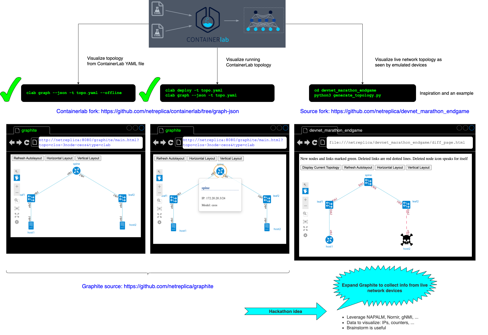

<p align=center></p>

---
# Netreplica Graphite
Network Visualization for Emulated Topologies

## CONTAINERlab

Graphite support for [Containerlab](https://containerlab.dev/) network emulation includes:

* Visualization of live topologies, including dynamic information about network nodes – for example, management IP addresses.
* Offline visualization of static topology YAML files.
* WebSSH access to running Containerlab nodes from the topology visualization.
* Launching Graphite as part of Containerlab topology by including it as a node in the topology YAML file.

### Launching Graphite as part of Containerlab topology

The easiest way to use Graphite with Containerlab is to add the following code to a topology YAML file under the `nodes:` section.

```Yaml
    graphite:
      kind: linux
      image: netreplica/graphite
      env:
        GRAPHITE_DEFAULT_TYPE: clab
        CLAB_SSH_CONNECTION: ${SSH_CONNECTION}
      binds:
        - __clabDir__/topology-data.json:/htdocs/clab/topology-data.json:ro
      ports:
        - 8080:80
      exec:
        - sh -c 'graphite_motd.sh 8080'
      labels:
        graph-hide: yes
````

Once added, deploy the topology with `sudo -E containerlab deploy -t <topology.yaml>`. Note `-E` parameter for `sudo` – it is needed to pass `SSH_CONNECTION` variable.

Look for `Graphite visualization URL: http://<ip_address>:8080/graphite` Containerlab output. If you are running Containerlab on a VM via an SSH session, the `<ip_address>` in the URL should be the one you are using to connect to the VM, so there is a good chance the link will just work. If not, you might need to replace `<ip_address>` with proper address to connect to Graphite.

## Running Graphite as a standalone Docker container

To be able to visualize multiple Containerlab topologies, including those that are not currently running, you can launch Graphite as a standalone container. Follow [the guide](docs/DOCKER.md) to learn how.

## Detailed instructions on installing and using Graphite from source code.

Follow [step-by-step reference](docs/CONTAINERLAB.md) to learn how to use Graphite with ContainerLab from source code.

## NANOG-84 Hackathon

Graphite was conceived as part of [NANOG-84 Hackathon](https://www.nanog.org/events/nanog-84-hackathon/). Here is an original idea:



## Copyright notice

Copyright 2022 Netreplica Team

Licensed under the Apache License, Version 2.0 (the "License");
you may not use this file except in compliance with the License.
You may obtain a copy of the License at

   http://www.apache.org/licenses/LICENSE-2.0

Unless required by applicable law or agreed to in writing, software
distributed under the License is distributed on an "AS IS" BASIS,
WITHOUT WARRANTIES OR CONDITIONS OF ANY KIND, either express or implied.
See the License for the specific language governing permissions and
limitations under the License.
