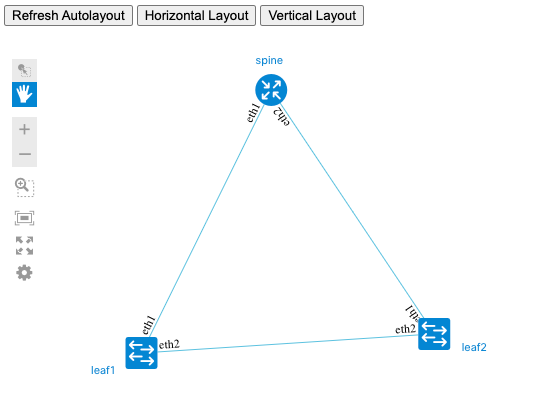

# Visualizing ContainerLab topologies on MacOS

  According to [ContainerLab documentation](https://containerlab.srlinux.dev/install/#mac-os), running vanilla clab on MacOS is possible using Docker Desktop.  Testing revealed that this does not work with new M1 silicon[^1], however, and was successful only on an older Intel-based chipset[^2]. It will also not support vrnetlab-based nodes; see clab docs linked above for full details.  The following instructions assume you already have Docker Desktop and vanilla clab installed and running.

## Prerequisites

1. (Optional) The creation of a VM for experimentation with Graphite and custom ContainerLab builds was not tested for this macOS case, since a dedicated MacBook was available.  There is probably a way to do this; in fact there is evidently a way to [use multipass with hyperkit or VirtualBox](https://multipass.run/docs/installing-on-macos), to emulate step 1 in the [main ubuntu example](CONTAINERLAB.md). Please let us know what steps worked if anyone is successful on macOS.

2. Install `gcc` and [Go](https://golang.org/dl/) for your platform to build a custom ContainerLab binary. [Homebrew](https://brew.sh) was tested as the package manager for this macOS case, and Xcode Command Line Tools had already been installed on the test Mac. According to [this guy](https://mac.install.guide/commandlinetools/index.html), however, homebrew will install them for you if you haven't done so already.

  If homebrew is already installed on your system, use `brew info` to check if gcc and go are installed already. It's also a good idea to `brew update` and `brew upgrade` before installing.  Otherwise, after a fresh install with the curl command, skip ahead to `brew install` for both packages.

  From a Terminal window:

```shell
/bin/bash -c "$(curl -fsSL https://raw.githubusercontent.com/Homebrew/install/HEAD/install.sh)"
brew info gcc
brew info go
brew update
brew upgrade
brew install gcc
brew install go
go version
```

3. Build a new, custom ContainerLab binary with topology export capabilities. Create an alias `clabg` for the binary.

  Currently (Feb'22), the standard ContainerLab build doesn't have the capability to export a topology data model suitable for Graphite. There is a [proposal](https://github.com/srl-labs/containerlab/issues/703) to introduce such an option into the product, as well as a possible [implementation](https://github.com/netreplica/containerlab/tree/graph-json). The current Graphite version relies on that implementation.
  
  As a prerequisite, please build a custom ContainerLab binary with topology export capabilities. You can continue using the official build for all other ContainerLab operations, and use this custom build in parallel to export topology data.
  
```shell
cd $HOME
git clone https://github.com/netreplica/containerlab.git
cd containerlab
git checkout graph-json
go build
```
 - At this point in the macOS installation, an `undefined: netlink.FAMILY_V4` error and a similar V6 error was encountered. This is evidently a limitation in the macOS go implementation; to work around this, cross-compile for linux as follows (of course, you may be able to set this environment variable in the first place before the "go build" above, but it was not tested).

```shell
GOOS=linux
go build
```

 - This is the point where we need Docker Desktop running as mentioned in the [clab docs](https://containerlab.srlinux.dev/install/#mac-os), so go ahead and start it up if it wasn't up already.  Once it's running, minimize it and return to Terminal to continue starting up the shell for the custom clabg:

```Shell
CLABG_WORKDIR=$HOME/containerlab
docker run --rm -it --privileged \
    --network host \
    -v /var/run/docker.sock:/var/run/docker.sock \
    -v /run/netns:/run/netns \
    --pid="host" \
    -w $CLABG_WORKDIR \
    -v $CLABG_WORKDIR:$CLABG_WORKDIR \
    ghcr.io/srl-labs/clab bash
````

  Now you should get a `bash-5.1# ` prompt, which means you are in the container for the custom graphite-ready build of containerlab that you just created.  We'll alias that to "clabg" so that it does not conflict with the vanilla clab directory that should also exist in $HOME if you installed that before.

```Shell
alias clabg="`pwd`/containerlab"
clabg graph -h | grep json
````

  You should see an output with `--json` option designed to `generate json file instead of launching the web server`.
  

4. Clone Graphite and NextUI repositories

```Shell
mkdir -p $HOME/clabs
cd $HOME/clabs
git clone https://github.com/netreplica/graphite.git
git clone https://github.com/netreplica/next-bower.git
````

5. Install and configure Lighttpd, if it's not there already, to serve Graphite web pages. You can use any other web server you prefer, please use configuration below as a reference.

```Shell
brew info lighttpd
brew install lighttpd
echo $HOME/clabs
sudo vi /usr/local/etc/lighttpd/lighttpd.conf
````

Replace `server.document-root` value with the full path to a directory with ContainerLabs topologies and Graphite file (see `echo` output above). WARNING! This is a very basic setup for experimentation without any security measures. DO NOT USE IT AS IS for ContainerLab deployments that contain sensitive device configurations.

````
server.document-root = "/Users/yourname/clabs" 
````

Restart the server using `brew services restart` (you will have to use `brew tap` beforehand if this is a new install):

````
brew tap homebrew/services
brew services restart lighttpd
brew services list
````

You should see something like the following if lighttpd has started successfully:

```shell
% brew services list
Name     Status  User   File
lighttpd started yourname ~/Library/LaunchAgents/homebrew.mxcl.lighttpd.plist
```

6. Validate access to Graphite web pages by opening the following URL in the browser: `http://REPLACE_IP:8080/graphite/main.html`. You should be able to see a sample topology:



  Note that brew's current install of lighttpd defaults to port 8080; it seems that this can be changed in the same lighttpd.conf file where you changed the server.document-root, and so the URL would change accordingly. On the test MacBook Pro, the localhost IP (127.0.0.1 from ifconfig) is what works, but this of course needs to be changed to the assigned externally-facing IP address if using a different system to browse.

[Return to Graphite Docs](CONTAINERLAB.md#visualize-a-topology-generated-from-a-containerlab-yaml-file-offline-mode) to continue with clab visualization.

[^1]: Although [Linux can finally run on Apple's M1 chipset](https://www.linux-magazine.com/Online/News/Linux-Can-Now-Run-on-Apple-s-M1-Chipset), the maintainer of ContainerLab, Roman Dodin, has said that it's "painful" to get Go apps to work on darwin/arm64, and even if they did get it working, thus far no NOS vendors have rebuilt their containerized images (such as srlinux and ceos) for the new Apple silicon. 

[^2]: Test system details:
  - macOS Catalina (10.15.7)
  - MacBook Pro (Retina, 13-inch, Late 2013)
  - Processor: 2.4 GHz Dual-core Intel Core i5
  - Memory: 8GB 1600 MHz DDR3
