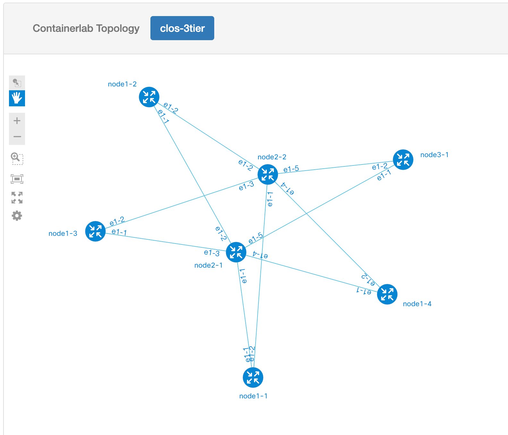

# Visualizing ContainerLab topologies

## Pre-requisites

1. (Optional) Create an Ubuntu VM for experimentation with Graphite and custom ContainerLab builds, to avoid impacting your working setup. Here is an example with `multipass`:

```Shell
multipass launch 20.04 -n clab-graphite -c4 -m8G -d50G
multipass shell clab-graphite
sudo apt update && sudo apt install jq docker.io -y
````

  If you prefer to use any other environment, please make sure it meets ContainerLab [pre-requisites](https://containerlab.srlinux.dev/install/#pre-requisites)

2. Install `gcc` and [Go](https://golang.org/dl/) for your platform to build a custom ContainerLab binary. Here is an example for Ubuntu:

```Shell
sudo apt update && sudo apt install build-essential -y
wget https://go.dev/dl/go1.17.7.linux-amd64.tar.gz
sudo bash -c "rm -rf /usr/local/go && tar -C /usr/local -xzf go1.17.7.linux-amd64.tar.gz"
cat >> ~/.bashrc << EOF
# Local go modules
if [ -d "/usr/local/go/bin" ] ; then
    PATH="\$PATH:/usr/local/go/bin"
fi

# Local go modules
if [ -d "\$HOME/go/bin" ] ; then
    PATH="\$PATH:\$HOME/go/bin"
fi

EOF
source ~/.bashrc
go version
````

3. Build ContainerLab binary with topology export capabilities. Create an alias `clabg` for the binary

  Currently (Feb'22), standard ContainerLab build doesn't have a capability to export topology data model suitable for Graphite. There is a [proposal](https://github.com/srl-labs/containerlab/issues/703) to introduce such option into the product, as well as a possible [implementation](https://github.com/netreplica/containerlab/tree/graph-json). Current Graphite version relies on that implementation.
  
  As a prerequisite, please build a custom ContainerLab binary with topology export capabilities. You can continue using official build for all other ContainerLab operations, and use custom build to export topology data.
  
```Shell
cd $HOME
git clone https://github.com/netreplica/containerlab.git
cd containerlab
git checkout graph-json
go build
alias clabg="`pwd`/containerlab"
clabg graph -h | grep json
````

  You should see an output with `--json` option designed to `generate json file instead of launching the web server`.
  

4. Clone Graphite and NextUI repositories

```Shell
mkdir -p $HOME/clabs
cd $HOME/clabs
git clone https://github.com/netreplica/graphite.git
git clone https://github.com/netreplica/next-bower.git
````

5. Install and configure Lighthttpd to server Graphite web pages. You can use any other web server you prefer, please use configuration below as a reference

```Shell
sudo apt install lighttpd -y
sudo vi /etc/lighttpd/lighttpd.conf
# +++
server.document-root        = "$HOME/clabs" 
# ---
sudo systemctl restart lighttpd
sudo systemctl status lighttpd
````

6. Validate access to Graphite web pages by opening the following URL in the browser: `http://REPLACE_IP/graphite/main.html`. You should be able to see a sample topology:


## Visualize a topology generated from a ContainerLab YAML file (offline mode)

1. Create a topology definition file for ContainerLab

  You could ctart with one of the examples [published](https://containerlab.srlinux.dev/lab-examples/lab-examples/) on ContainerLab website, or use your own topology. Here, we will use ContainerLab capability to generate Clos topologies.

```Shell
cd $HOME/clabs
CLAB_TOPO="clos-3tier"
clabg generate --name ${CLAB_TOPO} --nodes 4,2,1 > ${CLAB_TOPO}.clab.yml
````

2. Now that you have a topology file, let's export it in JSON format for Graphite. If you are using a different topology name, please save that name in an environmental variable `CLAB_TOPO` before using the examples below as is.


```Shell
clabg graph --json --topo ${CLAB_TOPO}.clab.yml --offline
````

  If all goes well, that command should've created a file `$HOME/clabs/clab-${CLAB_TOPO}/graph/${CLAB_TOPO}.clab.json`, which we can inspect with `jq` (this is optional, if you don't have `jq` installed):
  
```Shell
cat $HOME/clabs/clab-${CLAB_TOPO}/graph/${CLAB_TOPO}.clab.json | jq
````  

3. At this point you should be able to view the topology in Graphite via the following URL: `http://REPLACE_IP/graphite/main.html?type=clab&topo=clos-3tier`. In case you used a topology with a different name, please change `clos-3tier` in the URL string to your topology name. Here is an example of what you could see (rendering is unique with every page refresh):


