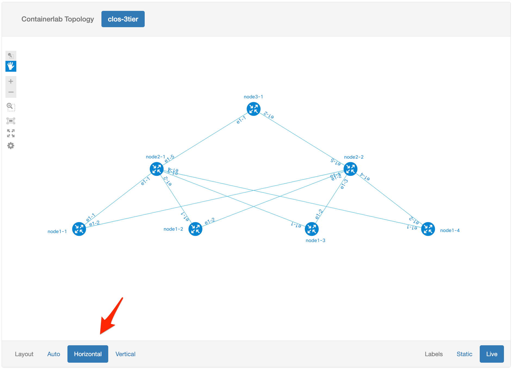
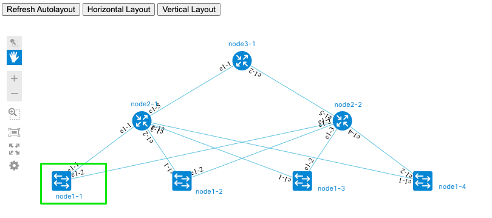
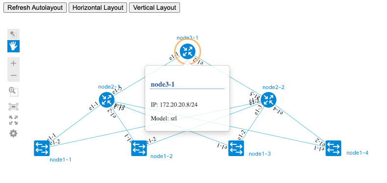

# Visualizing ContainerLab topologies

## Pre-requisites

1. (Optional) Create an Ubuntu VM for experimentation with Graphite and custom ContainerLab builds, to avoid impacting your working setup. Here is an example with `multipass`:

```Shell
multipass launch 20.04 -n clab-graphite -c4 -m8G -d50G
multipass shell clab-graphite
sudo apt update && sudo apt install jq docker.io -y
````

  If you prefer to use any other environment, please make sure it meets ContainerLab [prerequisites](https://containerlab.srlinux.dev/install/#pre-requisites)

2. Install `gcc` and [Go](https://golang.org/dl/) for your platform to build a custom ContainerLab binary. Here is an example for Ubuntu:

```Shell
sudo apt update && sudo apt install build-essential -y
wget https://go.dev/dl/go1.17.7.linux-amd64.tar.gz
sudo bash -c "rm -rf /usr/local/go && tar -C /usr/local -xzf go1.17.7.linux-amd64.tar.gz"
cat >> ~/.bashrc << EOF
# Local go modules
if [ -d "/usr/local/go/bin" ] ; then
    PATH="\$PATH:/usr/local/go/bin"
fi

# Local go modules
if [ -d "\$HOME/go/bin" ] ; then
    PATH="\$PATH:\$HOME/go/bin"
fi

EOF
source ~/.bashrc
go version
````

3. Build ContainerLab binary with topology export capabilities. Create an alias `clabg` for the binary

  Currently (Feb'22), standard ContainerLab build doesn't have a capability to export topology data model suitable for Graphite. There is a [proposal](https://github.com/srl-labs/containerlab/issues/703) to introduce such option into the product, as well as a possible [implementation](https://github.com/netreplica/containerlab/tree/graph-json). Current Graphite version relies on that implementation.
  
  As a prerequisite, please build a custom ContainerLab binary with topology export capabilities. You can continue using the official build for all other ContainerLab operations, and use this custom build in parallel to export topology data.
  
```Shell
cd $HOME
git clone https://github.com/netreplica/containerlab.git
cd containerlab
git checkout graph-json
go build
alias clabg="`pwd`/containerlab"
clabg graph -h | grep json
````

  You should see an output with `--json` option designed to `generate json file instead of launching the web server`.
  

4. Clone Graphite and NextUI repositories

```Shell
mkdir -p $HOME/clabs
cd $HOME/clabs
git clone https://github.com/netreplica/graphite.git
git clone https://github.com/netreplica/next-bower.git
````

5. Install and configure Lighttpd to serve Graphite web pages. You can use any other web server you prefer, please use configuration below as a reference

```Shell
sudo apt install lighttpd -y
echo $HOME/clabs
sudo vi /etc/lighttpd/lighttpd.conf
````

Replace `server.document-root` value with full path to a directory with ContainerLabs topologies and Graphite file (see `echo` output above). WARNING! This is very basic setup for experimentation without any security measures. DO NOT USE IT AS IS for ContainerLab deployments that contain sensitive device configurations.

````
server.document-root        = "/home/ubuntu/clabs" 
````

Restart the server:

````
sudo systemctl restart lighttpd
sudo systemctl status lighttpd
````

6. Validate access to Graphite web pages by opening the following URL in the browser: `http://REPLACE_IP/graphite/main.html`. You should be able to see a sample topology:


## Visualize a topology generated from a ContainerLab YAML file (offline mode)

1. Create a topology definition file for ContainerLab

  You could start with one of the examples [published](https://containerlab.srlinux.dev/lab-examples/lab-examples/) on ContainerLab website, or use your own topology. Here, we will use ContainerLab capability to generate Clos topologies.

```Shell
cd $HOME/clabs
CLAB_TOPO="clos-3tier"
clabg generate --name ${CLAB_TOPO} --nodes 4,2,1 > ${CLAB_TOPO}.yaml
````

  Alternatively, if you have an existing topology in a yaml file, you can skip this step and make a note of the caveats in the next step.

2. Now that you have a topology file, let's export it in JSON format for Graphite. Or, if you are using a different topology name, please save that name in an environment variable `CLAB_TOPO` before using the examples below as is.

   Note: If you are using an existing topology in a yaml file, simply ensure that the file is of the format ${CLAB_TOPO}.yml (or .yaml).  Also make sure that "name:" on the first line of the yaml file matches ${CLAB_TOPO}.

```Shell
clabg graph --json --topo ${CLAB_TOPO}.yaml --offline
````

  If all goes well, that command should've created a file `$HOME/clabs/clab-${CLAB_TOPO}/graph/${CLAB_TOPO}.json`, which we can inspect with `jq` (this is optional, if you don't have `jq` installed):
  
```Shell
cat $HOME/clabs/clab-${CLAB_TOPO}/graph/${CLAB_TOPO}.json | jq
````  

3. At this point you should be able to view the topology in Graphite via the following URL: `http://REPLACE_IP/graphite/main.html?type=clab&topo=clos-3tier`. In case you used a topology with a different name, please change `clos-3tier` in the URL string to your topology name. Here is an example of what you could see (rendering is unique with every page refresh):


## Improve visualization via custom labels in a ContainerLab YAML file

The visualization we got on the previous step lacks hierarchy. Let's fix that by assigning nodes in the ContainerLab topology YAML file to different levels, using custom labels that Graphite understands.

1. Open the topology YAML file in the text editor and append the following lines to each `node1-*` definition.

```Yaml
      labels:
        graph-level: 3
````

For example, `node1-1` definition should now look the following way:

```Yaml
topology:
  nodes:
    node1-1:
      kind: srl
      group: tier-1
      type: ixrd2
      labels:
        graph-level: 3
````

2. Now assign `graph-level: 2` to every `node2-*` definition.

```Yaml
      labels:
        graph-level: 2
````

3. And, finally, assign `graph-level: 1` to every `node3-*` definition.

```Yaml
      labels:
        graph-level: 1
````

4. Re-export JSON file

```Shell
clabg graph --json --topo ${CLAB_TOPO}.yaml --offline
````

5. Now refresh the web page in the browser, and click "Vertical Layout". You should see a topology arranged in 3 Clos tiers. `node3-1` is on the top since it has `graph-level` value of 1.



## Changing visualization icons

All the nodes in our visualization so far represented by the same "router" icon. Let's assume that nodes at tier-1 in our Clos topology can act as L2 switches, and we want to reflect that in the visualization. To achieve that, we can use custom label again, with a name `graph-icon`.


1. Open the topology YAML file in the text editor and append the following line to each `node1-*` definition.

```Yaml
        graph-icon: switch
````

For example, `node1-1` definition should now look the following way:

```Yaml
topology:
  nodes:
    node1-1:
      kind: srl
      group: tier-1
      type: ixrd2
      labels:
        graph-level: 3
        graph-icon: switch
````

  Possible graph-icon types are (from :

|   |   |   |
|---|---|---|
|switch|router|wlc|
|server|phone|nexus5000|
|ipphone|host|camera|
|accesspoint|cloud|unlinked|
|firewall|hostgroup|wirelesshost|

2. Re-export JSON file

```Shell
clabg graph --json --topo ${CLAB_TOPO}.yaml --offline
````

3. Now refresh the web page in the browser, and click "Vertical Layout". Now the bottom row of nodes uses "switch" icons.



## Visualize running ContainerLab topology

1. First, we need to provide an image to use for all the nodes. Add the following lines to the topology YAML file right after `topology` line:

```Yaml
topology:
  kinds:
    srl:
      image: ghcr.io/nokia/srlinux
````

2. Now deploy the ContainerLab topology and update visualization

```Shell
sudo $HOME/containerlab/containerlab deploy --topo ${CLAB_TOPO}.yaml
sudo $HOME/containerlab/containerlab graph --json --topo ${CLAB_TOPO}.yaml
````

3. Now refresh the web page in the browser, click on any node icon. You can see a management IP of each node in the tooltip that appears. These IPs were dynamically assigned by ContainerLabs when the topology was deployed.




4. To stop running the topology, use

```Shell
sudo $HOME/containerlab/containerlab destroy --topo ${CLAB_TOPO}.yaml
````
