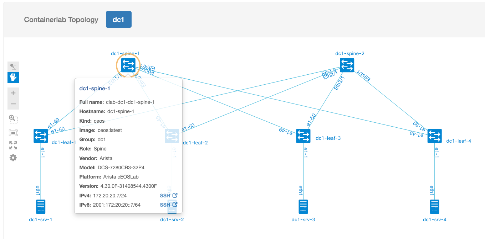

# Labels

## Node labels

When you click on a node in the topology diagram, a view pops up with node details:



The table belows shows where the values of each field in the popup come from, depending on the type of the topology.

| Label      | NetBox                | Containerlab          | Live Data
| -----      | -------------------   | -------------------   | --------
| Name       | `nodes: {name}`       | `nodes: {name}`       | N/A
| Full name  | N/A                   | `longname`            | Ansible inventory
| Hostname   | N/A                   | N/A                   | `hostname`
| Kind       | N/A                   | `kind`                | N/A
| Image      | N/A                   | `image`               | N/A
| Group      | `labels: group`       | `labels: group`       | N/A
| Role       | `labels: role`        | `labels: role`        | N/A
| Vendor     | `labels: vendor`      | `labels: vendor`      | N/A
| Model      | `labels: model`       | `labels: model`       | N/A
| Platform   | `labels: platform`    | `labels: platform`    | `vendor model`
| Version    | N/A                   | N/A                   | `os_version`
| IPv4       | `mgmt-ipv4-address`   | `mgmt-ipv4-address`   | N/A
| IPv6       | `mgmt-ipv4-address`   | `mgmt-ipv6-address`   | N/A

Special labels

| Label      | NetBox                | Containerlab          | Live Data
| -----      | -------------------   | -------------------   | --------
| Node icon  | `labels: graph-icon`  | `labels: graph-icon`  | N/A
| Node level | `labels: graph-level` | `labels: graph-level` | N/A
| Node display mode | `labels: graph-mode` | `labels: graph-mode` | N/A

## Node icons

Possible graph-icon values, based on [Cisco DevNet NeXT UI API doc](https://developer.cisco.com/site/neXt/document/api-reference-manual/files/src_js_graphic_svg_Icons.js/#l11):

| `label: graph-icon`   |
| ------------          |
| `switch`              |
| `router`              |
| `wlc`                 |
| `server`              |
| `phone`               |
| `nexus5000`           |
| `ipphone`             |
| `host`                |
| `camera`              |
| `access`              |
| `cloud`               |
| `unlinked`            |
| `firewall`            |
| `hostgroup`           |
| `wirelesshost`        |

## `port` visualization mode

Some nodes that can be used within the topology may not act as regular network devices. Examples of such nodes could be

  * Linux hosts with disabled IP forwarding,
  * Traffic Generators.

If such node has multiple interfaces connected to the emulated topology, its visualization might not represent their role well. To address this, there is a special `port` visuzalization mode available in Graphite. With such mode enabled for a node, each its interface would be displayed as a separate icon with a name "interface-name@node-name". Below is an example of using `port` mode for `ixia-c-one` traffic generator, together with a "cloud" icon:

```Yaml
    ixia:
      kind: keysight_ixia-c-one
      image: ghcr.io/open-traffic-generator/ixia-c-one:0.0.1-2770
      labels:
        graph-icon: cloud
        graph-mode: port
  links:
    - endpoints: ["pe-router:eth1","ce-router:eth1"]
    - endpoints: ["pe-router:eth2","ixia:eth1"]
    - endpoints: ["ce-router:eth2","ixia:eth2"]
```

The `ixia` node will be visualized as two icons `eth1@ixia` and `eth2@ixia`:


